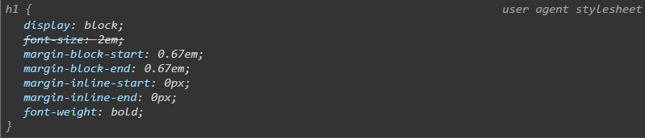

# CSS Units and Sizes

[CSS Units and Values](https://developer.mozilla.org/en-US/docs/Learn/CSS/Building_blocks/Values_and_units)

CSS units determine the size of everything in your page

## Absolute Length Units 
In absolute length units we will commonly is pixels 
```
p {
    font-size: 16px;
}
```

### Default Font Size of browser
we can set a absolute size to the font in our paragraph 
we want to the default in any browser is usually 16 so if i set it to 16 we don't see a change but if i set it to 32 we definitely see a change it gets twice as big 

i'll choose very large we definitely see a change on the settings page right when i do that back in our document we don't see a change it didn't change at all i can refresh and it won't make any difference it did not change our font size with the user settings and that's because we took that choice away when we said no these absolutely must be 16 pixels here that's our root size but if i delete this and we just let the browser handle the default size instantly all of our font gets bigger and our user settings take over we don't want to take that choice away from the users so we don't want to use an absolute font size such as a pixel

where would we want to ***use pixels in absolute value*** there are other settings that we might want an absolute value for so i'll select the h1 that i have here and i'm going to set a ***border*** on it and i'll set it to 2 pixels and then just so we can see it better i'll set it to dashed and red so it really stands out and save and now we can see this border around our h1 element and we have this absolute value for the pixel width and no matter what happens to the page on a small viewport large viewport whether it's a mobile device or a large desktop screen this will remain as two pixels and ***that's okay in this instance***

## Numbers, lengths, and percentages
A ***percentage*** represents a fraction of some other value. For example, 50%. Percentage values are always relative to another quantity. For example, an element's length is relative to its parent element's length.

### h1
now by default an h1 is a block level element and so by default it has a width of 100 so if we do that we're not really changing anything and now it's just 100 percent as expected 

### block level element
block level element to take up 100 of the width of the page you don't really need to set it because that is the default

### other uses of percentages
other uses for percentages as well but you commonly see them to set the sizing of different elements as far as the width of the page or sometimes the height but also we don't need to set the height because it will grow as the content grows

## Relative length units
Relative length units are relative to something else, perhaps the size of the parent element's font, or the size of the viewport. The benefit of using relative units is that with some careful planning you can make it so the size of text or other elements scales relative to everything else on the page. Some of the most useful units for web development are listed in the table below.

### rem	 and em
Font size of the root element.

rem this is the unit that we'll ***typically use for font size*** and it ***relates to the font size of the root element***


now i already suggested we shouldn't set a font size on the root element so for our html element we typically wouldn't set a font size in here because we want to let the browser handle that and set the default font size so let's not do this for the html element i'll just go ahead and cut this

```
p {
    font-size: 1rem;
}
```
***one ram that's already the default so it shouldn't change anything*** and we see the size is the same so it says one root element which the root element is the default font size set by the browser the em doesn't stand for element  by the way that's m so we have one root em or one root m but that means the root size that is defined and in our case when we don't set it then it's set by the browser so hopefully that clears up some confusion but if we put in two m's then it's going to double the default size and now we're probably at 32 pixels right here because most browsers default to that 16 pixel size so you can see how this relates back to the root
```
main {
    font-size: 2rem;
}

p {
    font-size: 2rem;
}
```
now if we set a font size on the parent because our paragraph is in a main element we set this font size to to rem also it doesn't change the paragraph font size at all because the font set here is not relative to the main element it's not relative to the parent it's relative to the root which is defined by the browser so it's always going to look back to that default root size if we had set a font size in the html element it would be looking at that but without setting it it's the default


so what happens though if we switch these units if we're not using rem if we're using m just em
```
main {
    font-size: 2rem;
}

p {
    font-size: 2em;
}
```
our main element was looking at the root so it doubled that to 32 pixels and then using two ***em*** is looking at the main element which is the parent of the paragraph and so then it doubled that so now we're at 64 pixels

```
main {
    font-size: 2rem;
}

p {
    font-size: 2rem;
}
```
we have many elements we're styling we set another font size on a parent element suddenly it's amplified when we use ****em*** so i'm going to switch this back to two ***rem*** and get closer to the size we'd want and ***it's going to look at the root*** so when would we use ***em*** instead of ***rem*** we know we want to use ***rem*** on font size well when we set the font size on an element ***rem*** doesn't look at the parent ***it looks at the element itself***


```
h1 {
    font-size: 3rem; 
    padding: 1em; 
}
```
here padding 1em equivalent to font size or 3rem 

if we relate all this back to the default 16 pixel size one and a half of those would be 24 pixels whereas three rims would be 48 pixels another instance

***em doesn't look at the parent it looks at the element itself*** It use for margin , padding 

***button*** we could set the font size for that button with rem but then we could go ahead and set the padding and or margin with the ***em*** units

## ch
```
p {
    font-size: 2rem;
    width: 40ch;
}
```
ch that stands for character and we have the advanced measure width of the glyph zero which essentially means the character zero of the elements font so whatever font we're using it's the measurement of 0 and that helps us determine the

character width and that kind of comes from print magazine newspaper ***layout and those sort of things*** where you only want to have a certain width based on the character size so in this example we have a font size here for our paragraph i'm going to go ahead and set the width of the paragraph and let's say we don't want any more than an estimated 40 characters per line before the line wraps in the paragraph if we set that width notice it now has approximately 40 characters before the line wraps and
***that kind of helps us define columns if we're doing that in some type of layout***

## Browser default css

browser sets a default font size but it actually sets a lot of different default styles as well



it says user agent stylesheet this is what the browser is setting on the h1 element by default that we don't have to and you can see we have put in a different font size so we have overridden the font size for the h1 element

so it has crossed that out everything else here the display block and the different margins and even the font weight are applied from that user style sheet so those are default styles and we can override them just like i did with the font size 

## CSS reset
the selector that selects all elements again our wildcard selector 

```
* {
    margin: 0; 
    padding: 0;
    box-sizing: border-box;
}

```

## vh and wh 
```
body {
    width: 100vw;
}
```
we have viewport width which is one percent of the viewport's width and viewport height which is one percent of the viewport's height so let's look at how we can apply those but if we had that extra margin and padding there we wouldn't be able to see the detail

```
body{
    width: 100%;
}
```
***its better to use % percentage****

using the percentage and getting the same result and i'll give an example where the percentage is actually a better choice body element here and as i'd said before we don't need to set a width of a hundred percent but i'll put this in and i'm going to set this to 100 viewport with units instead and save

now we don't really notice a change and i have seen this on pages and i've even done it myself but i figured out the problem if we have a width of 100 viewport width units we do have a problem when the content out the vertical content outgrows the page and i'll show you why so i need to go back to the html and in the html i'm going to quickly add some more content so i'll say paragraph times 10 and we'll do this with some just sample lorem text that's an image abbreviation so when i press

tab it adds all those extra paragraphs and save now we've got lots of content here and now we have a problem and here's the problem our scroll bar showed up on the right which is good we need that to see all of this content but what also happened is we had a scroll bar show up down here on the bottom and that is because our viewport width when we set it to 100 as we did on the body right here does not account for this scroll bar on the right so as soon as this scroll bar on the right shows up and it shows up when our content

outgrows our height so when we need to scroll to see the content is when this shows up as it should but then that little extra bit that we can't see creates this scroll bar so we can see it and that's annoying and most developers don't like that horizontal scroll bar showing up so if you were to set the width 100 would be much more desirable because now we still get the scroll bar here where we can scroll up and down vertically we do not have a scroll bar on the bottom and we don't usually want that but overall as i've mentioned

before we don't even need to set 100 width on the body as it should default to that anyway

## full height
```
body {
    min-height: 100vh;
}
```
body is not the full height of the page it only grows with the content but sometimes we want a body element that is the full height of the page even if we don't have enough content to do that and we can do that with the viewport height unit and i'm going to do that over here in our code i'll choose the ***body element but i don't want to set height because that would also limit it to 100 vh and then we could outgrow*** that if our content were to ***outgrow what i want to do is set the min height to 100 vh*** and save and now that will still allow the body to grow with the content if it outgrows the viewport but at the same time it's now the full page and there could be instances where you want that 